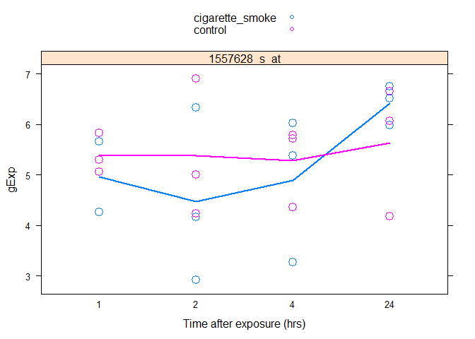

# homework1
Ali  
Monday, February 09, 2015  

**Homework01**

Feel free to skip my housekeeping section and go straight to Question 01

Before starting the analysis, do some basic housekeeping:
- It is good practice to load libraries and define functions at the start of a script
- Pre-screen the data for missing values (we already know there are none)
- Have a look at the variables to get familiar with the experimental design, e.g. (str(design.txt))
- Read relevent background literature, e.g. (http://www.ncbi.nlm.nih.gov/pmc/articles/PMC2527015/)
- look at the range and distribution of the data; does it make sense? Plotting datasets this large takes a lot of comput power; I like using summary(data.frame$variable) instead to check for balance, richness, etc.

**Housekeeping**

```r
#load libraries
library(car) #for recode
library(lattice) # for stripplot
data <- read.table("data.txt")
des <- read.table("design.txt")
newDat <- data.frame(gExp = as.vector(as.matrix(data)), sampleID = factor(colnames(data)), gene = factor(rownames(data)))
arDat <- suppressWarnings(data.frame(des, newDat))
summary(arDat$Treatment)
```

```
## cigarette_smoke         control 
##          250107          272844
```

There is some discrepancy between the number of observations between Treatments.


```r
table(arDat$Treatment, arDat$time)
```

```
##                  
##                     1_h   2_h  24_h   4_h
##   cigarette_smoke 45474 68211 68211 68211
##   control         68211 68211 68211 68211
```

And the culprit is the 1 hr treatment. This might be due to the removal of missing values, and/or a problem with the microarray or experimental design. Let's expect the number of replicates:


```r
table(arDat$sampleID, arDat$time)
```

```
##                     
##                        1_h   2_h  24_h   4_h
##   GSE10718_Biomat_1      0     0 22737     0
##   GSE10718_Biomat_10 22737     0     0     0
##   GSE10718_Biomat_11 22737     0     0     0
##   GSE10718_Biomat_12 22737     0     0     0
##   GSE10718_Biomat_13     0     0     0 22737
##   GSE10718_Biomat_14     0     0     0 22737
##   GSE10718_Biomat_15     0     0     0 22737
##   GSE10718_Biomat_16 22737     0     0     0
##   GSE10718_Biomat_17 22737     0     0     0
##   GSE10718_Biomat_19     0 22737     0     0
##   GSE10718_Biomat_2      0     0 22737     0
##   GSE10718_Biomat_20     0 22737     0     0
##   GSE10718_Biomat_21     0 22737     0     0
##   GSE10718_Biomat_22     0     0     0 22737
##   GSE10718_Biomat_23     0     0     0 22737
##   GSE10718_Biomat_24     0     0     0 22737
##   GSE10718_Biomat_3      0     0 22737     0
##   GSE10718_Biomat_4      0     0 22737     0
##   GSE10718_Biomat_5      0     0 22737     0
##   GSE10718_Biomat_6      0     0 22737     0
##   GSE10718_Biomat_7      0 22737     0     0
##   GSE10718_Biomat_8      0 22737     0     0
##   GSE10718_Biomat_9      0 22737     0     0
```

It looks like the intention was to have N = 6 for each time point; however, the 1 hr treatment only has N = 5. This will be important to keep in mind when performing statistics.

**Question 1a**

**Q** How many probes and how many samples?

**A** Simply take a look at the data.frame structure:

```r
str(arDat)
```

```
## 'data.frame':	522951 obs. of  6 variables:
##  $ ExternalID: Factor w/ 23 levels "GSM270872","GSM270873",..: 11 3 2 1 9 8 7 14 13 16 ...
##  $ Treatment : Factor w/ 2 levels "cigarette_smoke",..: 2 2 2 2 2 2 2 1 1 1 ...
##  $ time      : Factor w/ 4 levels "1_h","2_h","24_h",..: 3 1 1 1 4 4 4 1 1 2 ...
##  $ gExp      : num  7.9 6.13 6.82 6.63 6.95 ...
##  $ sampleID  : Factor w/ 23 levels "GSE10718_Biomat_1",..: 1 2 3 4 5 6 7 8 9 10 ...
##  $ gene      : Factor w/ 22737 levels "1294_at","1316_at",..: 1 2 3 4 5 6 7 8 9 10 ...
```

The number of probes is 22737, and the number of samples is 23.

**Question 1b**

**Q** What is the breakdown of samples for treatment and time?

**A** HAH! This question is addressing the same thing I discovered in my "housekeeping" section above. (Please refer to the above code for more details). There are 4 time points (1h, 2h, 4h, and 24h), with N = 6 each except for 1h, with N = 5. The design is slightly unbalanced.

**Question 1c**

**Q** Create a quantitative variable that represents the time at which cells were measured

**A** Use the 'recode' function in the 'cars' package.


```r
des$time <- recode(des$time, "'1_h' =1; '2_h'=2; '4_h'=4; '24_h'=24", as.factor.result = FALSE)
quantDat <- suppressWarnings(data.frame(des, newDat))
head(quantDat)
```

```
##   ExternalID Treatment time     gExp           sampleID    gene
## 1  GSM270883   control   24 7.900022  GSE10718_Biomat_1 1294_at
## 2  GSM270874   control    1 6.126008 GSE10718_Biomat_10 1316_at
## 3  GSM270873   control    1 6.822491 GSE10718_Biomat_11 1320_at
## 4  GSM270872   control    1 6.633596 GSE10718_Biomat_12 1431_at
## 5  GSM270881   control    4 6.948795 GSE10718_Biomat_13 1438_at
## 6  GSM270880   control    4 9.887123 GSE10718_Biomat_14 1487_at
```

**Question 1d**

**Q** Create a plot showing the gene expression data for one probe and the averages for all possible combinations of Treatment and time

**A** I think the simplest solution would make a colour-coded stripplot. The line connects time categories in order and passes through the average for each treatment.


```r
#decide on a gene
set.seed(1)
(samp <- sample(1:nrow(arDat), size = 1))
```

```
## [1] 138849
```

```r
#which gene did I get? 
head(arDat[samp, ])
```

```
##        ExternalID Treatment time     gExp          sampleID         gene
## 138849  GSM270878   control  2_h 4.235724 GSE10718_Biomat_7 1557628_s_at
```

```r
specialGene = "1557628_s_at"
oneGene <- (subset(quantDat, subset = gene %in% specialGene))
#sanity check
head(oneGene[1:3, ])
```

```
##       ExternalID       Treatment time     gExp           sampleID
## 2427   GSM270888 cigarette_smoke    2 2.910596 GSE10718_Biomat_20
## 25164  GSM270874         control    1 5.820400 GSE10718_Biomat_10
## 47901  GSM270892 cigarette_smoke    4 5.373230 GSE10718_Biomat_23
##               gene
## 2427  1557628_s_at
## 25164 1557628_s_at
## 47901 1557628_s_at
```

```r
#a stripplot function I wrote for another seminar:
makeStrip <- function(df) {
  stripplot(gExp ~ as.factor(time) | gene, df,
          group = Treatment, xlab = "Time after exposure (hrs)", jitter.data = FALSE, cex=1.5, lwd = 2,  
          auto.key = TRUE, type = c('p', 'a'))
}
makeStrip(oneGene)
```

 
** TO DO **

- Report averages for each treatment, time (the line passes through the average, but this is not explicit)
- format the figure more nicely, maybe in ggplot2 instead of lattice
