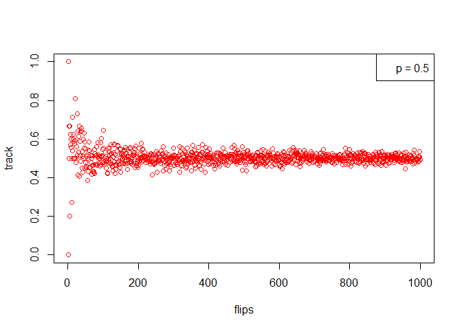
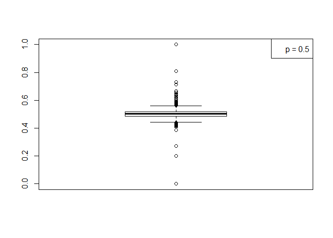

# seminar02b
Ali  
Wednesday, January 21, 2015  

tosses = times the coin is flipped in one try
tries = toss events
p = probability of getting a head
turn coinflips into a function


```r
coinflips <- function(tosses, tries, p){
  tab <- matrix(runif(tosses * tries) > p,
              nrow = length(tosses), ncol=tries)
  y <- rowSums(tab)
  y.mean <- mean(y)
  prop <- (y.mean/tries)
  return(prop)
}
coinflips(1, 100, 0.5)
```

```
## [1] 0.55
```

loop over many tries

B <- 1000
n <- 1
track <- matrix(nrow = B, ncol = n, dimnames = list(c(1:B),names(n)))
for (i in 1:B) {
  track[i,] <- coinflips(1, i, 0.5)
}
tail(track)

```r
B <- 1000
n <- 1
track <- matrix(nrow = B, ncol = n, dimnames = list(c(1:B),names(n)))
for (i in 1:B) {
  track[i,] <- coinflips(1, i, 0.5)
}
tail(track)
```

```
##           [,1]
## 995  0.4783920
## 996  0.5100402
## 997  0.5245737
## 998  0.5160321
## 999  0.5145145
## 1000 0.5010000
```
expect convergence around y = 0
make scatter plot

plot(track, xlab="flips", col="red")
legend("topright", c("p = 0.5"))

<<<<<<< HEAD
 
=======
```{r, echo=FALSE}
plot(track, xlab="flips", col="red")
legend("topright", c("p = 0.5"))
```
>>>>>>> 89b43bb333de1c0e34b49147a9f927ef2d2d80ae
or make a boxplot

boxplot(track)
legend("topright", c("p = 0.5"))

 
