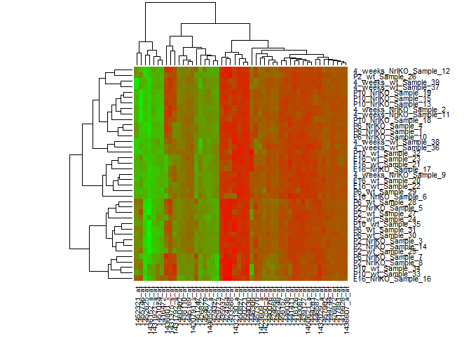

# seminar03b
Ali  
Sunday, January 25, 2015  

Essentially the code supplied by Dean:


```r
getwd()
```

```
## [1] "C:/Users/Ali/Documents/R/GSAT540/seminar03c"
```

```r
library(reshape2)
library(RColorBrewer)
library(ggplot2)
set.seed(10)
prDat <- read.table("GSE4051_data.txt")
prDes <- readRDS("GSE4051_design.rds")
yo <- sample(1:nrow(prDat), size = 50)
hDat <- prDat[yo, ]
#head(hDat)
colnames(hDat) <- with(prDes, paste(devStage, sidChar, gType, sep = "_"))

prDatTall <- data.frame(sample = rep(colnames(hDat), each = nrow(hDat)),
                        probe = rownames(hDat),
                        expression = unlist(hDat))
#head(prDatTall)
jRdPuFun <- colorRampPalette(brewer.pal(n = 9, "RdPu"))
paletteSize <- 50
jRdPuPalette <- jRdPuFun(paletteSize)
```

 


I had trouble figuring out how to do hierarchical clustering in ggplot, so here is a similar map generated with the in-built "heatmap" function. 


```r
set.seed(1)
prDat <- read.table("GSE4051_data.txt")
smDat <- prDat[sample(1:nrow(prDat), 50, replace=FALSE),]
tDat <- t(smDat)
rnames <- tDat[1,]
matDat <- data.matrix(tDat[,1:ncol(tDat)])
rownames(matDat) <- with(prDes, paste(devStage, gType, sidChar, sep = "_"))
# creates a own color palette from red to green
my_palette <- colorRampPalette(c("red", "green"))(n = 299)
heatmap(matDat, Rowv = FALSE, col=my_palette)
```

 

I would really like to be able to arrange this map in order of development and genotype... any quick tips?


