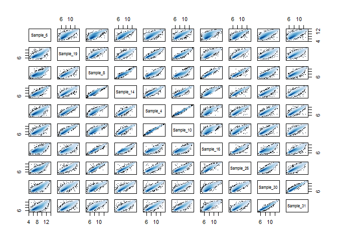
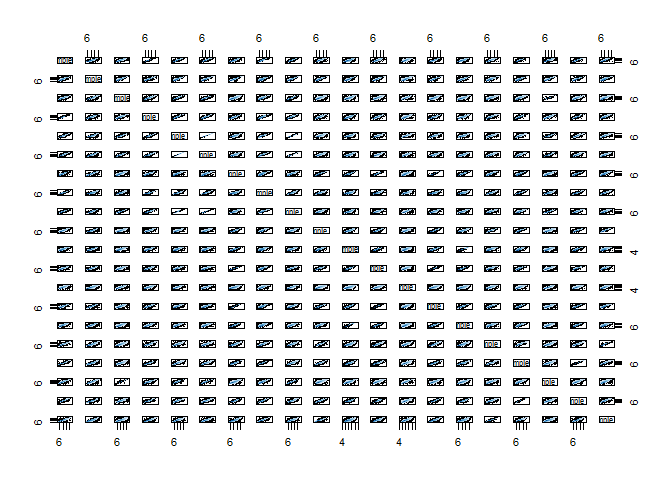
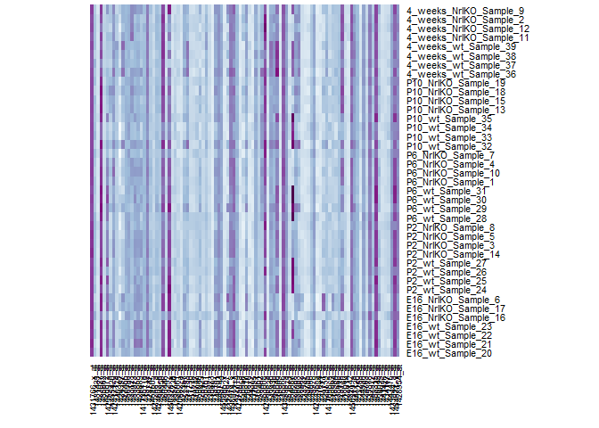

# seminar03c
Ali  
Monday, January 26, 2015  
Choose 100 random samples to explore


```r
#install.packages("hexbin")
library(lattice)
library(hexbin)
prDat <- read.table("GSE4051_data.txt")
#str(prDat, max.level = 0)
prDes <- readRDS("GSE4051_design.rds")
#str(prDes)
set.seed(1)
(yo <- sample(1:nrow(prDat), size = 100))
```

```
##   [1]  7952 11145 17156 27198  6040 26902 28287 19786 18837  1850  6167
##  [12]  5286 20568 11499 23046 14899 21481 29690 11375 23269 27975  6350
##  [23] 19503  3758  7997 11555   401 11442 26023 10184 14424 17938 14766
##  [34]  5571 24751 19997 23759  3229 21647 12302 24554 19353 23416 16540
##  [45] 15842 23605   698 14271 21897 20713 14281 25749 13098  7319  2113
##  [56]  2974  9455 15504 19788 12161 27285  8776 13721  9934 19452  7711
##  [67] 14301 22899  2518 26155 10132 25081 10358  9972 14231 26654 25821
##  [78] 11650 23220 28694 12983 21282 11947  9717 22611  6054 21237  3634
##  [89]  7331  4280  7156  1760 19177 26162 23255 23803 13592 12242 24206
## [100] 18058
```

```r
hDat <- prDat[yo, ]
#str(hDat)
hDat <- as.matrix(t(hDat))
rownames(hDat) <- with(prDes,
                       paste(devStage, gType, sidChar, sep="_"))
#str(hDat)
set.seed(3)
(yo <- sample(1:ncol(prDat), size = 10))
```

```
##  [1]  7 31 15 12 22 21  5 10 18 19
```

```r
pairDat <- subset(prDat, select = yo)
#str(pairDat)
```

plot pairwise gene expression for 10 out of the 100 samples

```r
#png("2by2.png")
pairs(pairDat,
panel = function(...) smoothScatter(..., add=TRUE))
```

 

```r
#dev.off()
```

and for all 39 columns


```r
(yo <- sample(1:ncol(prDat), size = 20))
```

```
##  [1] 20 39 38 21 31 29  4 23 28  9  7  1 33  3  6 19 14 36 12 16
```

```r
pairDat <- subset(prDat, select = yo)
#png("2by2_39.png")
pairs(pairDat,
      panel = function(...) smoothScatter(..., add=TRUE))
```

 

```r
#dev.off()
```

It was pretty slow, even for 10! very slow for 20, and this gave a totally uninformative result. Probably the most samples this can be done for is ~10. Heatmaps seem to be much better for getting a quick look at the big picture, but you can't identify things like tightly correlating genes, like we see for some of the samples here (e.g. samples_4 and sample_10)


```r
library(RColorBrewer)
(yo <- sample(1:nrow(prDat), size = 100))
```

```
##   [1] 11356 11180  5100 13575  7739 10070 26637  6047 17342  6217  8427
##  [12] 23540  5180 17086 12552  8012  1432  3098  9400 23964  6864  6375
##  [23] 26249 29724 25265 27244 14102  6716  3825  8369 24418  1724 24019
##  [34]  3123 22934  9119 23012 16173 10839  2769 22724 22755 27014 28898
##  [45] 15409 16432  4896  4922 23513 22459 23448 19564 11305   257 28560
##  [56] 25070  6380 14788 19018 27532   352  7993 13018 24790 26029  7503
##  [67]  9693  9151  5507 20318 22898 20381  6249 21271 18084 10174  1230
##  [78] 12002  2362  9336  9710  2341  4487  4553 27280 20973 24505 19876
##  [89]  6456 13828 21405 24549 29863  5970 17947 12833 19034 12539 26266
## [100]  9574
```

```r
hDat <- prDat[yo, ]
#str(hDat)
hDat <- as.matrix(t(hDat))
rownames(hDat) <- with(prDes,
                       paste(devStage, gType, sidChar, sep="_"))
#str(hDat)
jBuPuFun <- colorRampPalette(brewer.pal(n = 9, "BuPu"))
#png("heatmap.png")
heatmap(hDat,  Colv = NA, Rowv = NA, scale="none", margins = c(5, 8),
        col = jBuPuFun(256))
```

 

```r
#dev.off()
```
 Overall the gene expression looks pretty similar between the KO and wt genotypes. I suppose this is as expected, because Nrl probably only influences the expression of a handful of genes, maybe not even in the subset of 100 that I chose here. 

There are a few samples that have overall less intense expression signatures compared to the others (e.g. sample 16), which is probably some kind of experimental artifact.. 

From here I will cherry pick one or two genes that look like they're different between wt and KO (based on a smaller heatmap, which is easier to look at)

Will update soon....


