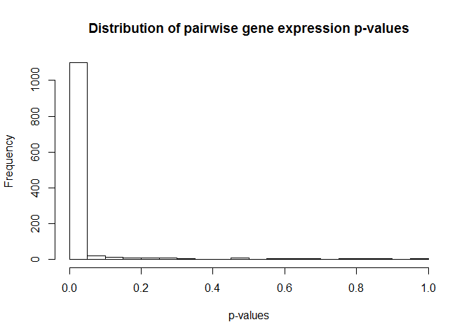
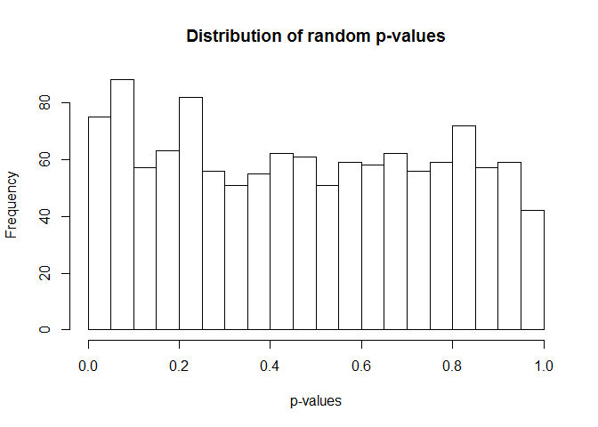

# seminar04a
Ali  
Sunday, February 01, 2015  

```r
library(lattice)
library(ggplot2)
library(plyr)

prDat <- read.table("GSE4051_data.txt")
prDes <- readRDS("GSE4051_design.rds")
#select 50 rows (gene names) to keep
keepGenes <- c(rownames(prDat[1:50,])) #should really be random...
#new 50 gene data frame
miniDat <- subset(prDat, rownames(prDat) %in% keepGenes)
miniDat <- data.frame(gExp = as.vector(as.matrix(miniDat)), gene = factor(rownames(miniDat)), each = ncol(miniDat), levels = keepGenes)
```

the following code will not work (of course!). Must sample 2 rows out of the 50 instead


```r
#tTest
#ttRes <- ddply(miniDat, {
#  zz <- t.test(miniDat$gExp ~ gene)
#round(c(tStat = zz$statistic, pVal = zz$p.value), 4)
#})
```

tried to solve the problem with the following approach, but was unsuccessful... 


```r
#for(i in 1:nrow(miniDat)) {
#  for(n in 1:nrow(miniDat)) {
#    newDat = subset(miniDat[i:i+n,])
#    str(newDat)
#    zz <- t.test(newDat$gExp ~ newDat$gene) 
#  }
#}
```

the combn function is much more elegant (found on someone else's repository)... thank you! 


```r
set.seed(1)
genes <- sample(1:nrow(prDat),50)
smDat <- prDat[genes,]
ind = (combn(1:50, 2))

pvals=rep(0,ncol(ind))
for (i in 1:ncol(ind))
  {
  pvals[i]=t.test(smDat[ind[1,i],],smDat[ind[2,i],])$p.value
  }
#plot
hist(pvals,breaks=30, xlab ="p-values", main = paste("Distribution of pairwise gene expression p-values"))
```

 

now for a random 50x50 matrix


```r
rDat = matrix( rnorm(50*50) , nrow=50 , ncol=50 )
ind = (combn(1:50, 2))

pvals=rep(0,ncol(ind))
for (i in 1:ncol(ind))
  {
  pvals[i]=t.test(rDat[ind[1,i],],rDat[ind[2,i],])$p.value
  }
hist(pvals,breaks=30, xlab ="p-values", main = paste("Distribution of random p-values"))
```

 

The histograms have a very different shape because unlike the randomly generated numbers, the expression levels of most genes do come from different distributions; therefore, their p-values were mostly small, as we would expect.

