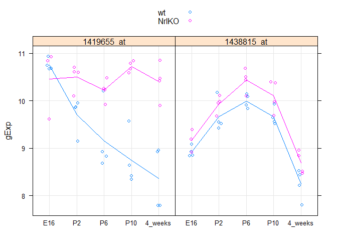
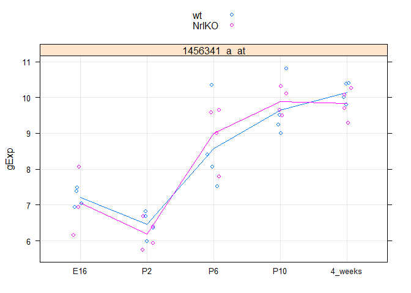
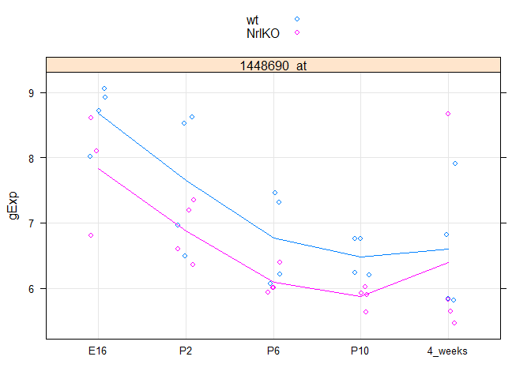

# seminar05
Ali  
Wednesday, February 04, 2015  

**Preliminary work** 
  - Not take-home problems; feel free to skip


```r
library(lattice) # if you don't already have this loaded ...
library(ggplot2) # we'll make figures with both
library(reshape2) # for the function melt
library(dplyr) #for pipe
```

```
## 
## Attaching package: 'dplyr'
## 
## The following object is masked from 'package:stats':
## 
##     filter
## 
## The following objects are masked from 'package:base':
## 
##     intersect, setdiff, setequal, union
```

```r
prDat <- read.table("GSE4051_data.txt")
prDes <- readRDS("GSE4051_design.rds")
#define genes of interest (GOI)
gen <- c("1419655_at","1438815_at")

#df = dataframe
#des = .rds
#GOI = vector of genes of interest

prepDat <- function(df, des, GOI) {
  miniDat <- subset(df, rownames(df) %in% GOI)
  miniDat <- data.frame(gExp = as.vector(t(as.matrix(miniDat))),
                      gene = factor(rep(rownames(miniDat), each = ncol(miniDat)),
                                    levels = GOI))
  miniDat <- suppressWarnings(data.frame(des, miniDat))
  return(miniDat)
}

#check 
smDat <- prepDat(df = prDat, des = prDes, GOI = gen)
str(smDat)
```

```
## 'data.frame':	78 obs. of  6 variables:
##  $ sidChar : chr  "Sample_20" "Sample_21" "Sample_22" "Sample_23" ...
##  $ sidNum  : num  20 21 22 23 16 17 6 24 25 26 ...
##  $ devStage: Factor w/ 5 levels "E16","P2","P6",..: 1 1 1 1 1 1 1 2 2 2 ...
##  $ gType   : Factor w/ 2 levels "wt","NrlKO": 1 1 1 1 2 2 2 1 1 1 ...
##  $ gExp    : num  10.93 10.74 10.67 10.68 9.61 ...
##  $ gene    : Factor w/ 2 levels "1419655_at","1438815_at": 1 1 1 1 1 1 1 1 1 1 ...
```

```r
makeStrip <- function(df) {
  stripplot(gExp ~ devStage | gene, df,
          group = gType, jitter.data = TRUE,
          auto.key = TRUE, type = c('p', 'a'), grid = TRUE)
}
#test
makeStrip(smDat)
```

 

```r
devs <- c("P2", "4_weeks")
makeStrip(newDat <- prepDat(prDat, prDes, "1456341_a_at"))
```

 

```r
devDat <- subset(newDat, subset = devStage %in% devs)

#tTest
t.test(gExp ~ devStage, devDat)
```

```
## 
## 	Welch Two Sample t-test
## 
## data:  gExp by devStage
## t = -18.8415, df = 13.977, p-value = 2.477e-11
## alternative hypothesis: true difference in means is not equal to 0
## 95 percent confidence interval:
##  -4.077668 -3.244082
## sample estimates:
##      mean in group P2 mean in group 4_weeks 
##              6.325750              9.986625
```

```r
#anova
mDat <- prepDat(prDat, prDes, "1438786_a_at")
sumStat <- (lm(formula = gExp ~ devStage, data = mDat, subset = gType == "wt"))

#write contMat for P2 and P10
head(coef(sumStat))
```

```
##     (Intercept)      devStageP2      devStageP6     devStageP10 
##         8.52275        -1.45025        -0.10675        -1.20125 
## devStage4_weeks 
##         0.08100
```

```r
cont <- rbind(c(0, 1, 0, -1, 0))
(obsDiff <- cont %*% coef(sumStat))
```

```
##        [,1]
## [1,] -0.249
```

```r
vcov(sumStat)
```

```
##                 (Intercept) devStageP2 devStageP6 devStageP10
## (Intercept)       0.1435072 -0.1435072 -0.1435072  -0.1435072
## devStageP2       -0.1435072  0.2870144  0.1435072   0.1435072
## devStageP6       -0.1435072  0.1435072  0.2870144   0.1435072
## devStageP10      -0.1435072  0.1435072  0.1435072   0.2870144
## devStage4_weeks  -0.1435072  0.1435072  0.1435072   0.1435072
##                 devStage4_weeks
## (Intercept)          -0.1435072
## devStageP2            0.1435072
## devStageP6            0.1435072
## devStageP10           0.1435072
## devStage4_weeks       0.2870144
```

```r
(estSe <- cont %*% vcov(sumStat) %*% t(cont))
```

```
##           [,1]
## [1,] 0.2870144
```

```r
(testStat <- obsDiff/estSe)
```

```
##            [,1]
## [1,] -0.8675523
```

```r
2 * pt(abs(testStat), df = df.residual(sumStat), lower.tail = FALSE)
```

```
##           [,1]
## [1,] 0.3993062
```

```r
#fit 2 covariates
makeStrip(oDat <- prepDat(prDat, prDes, "1448690_at"))
```

 

```r
cov <- (lm(formula = gExp ~ devStage * gType, data = oDat))
summary(cov)$coef
```

```
##                               Estimate Std. Error     t value     Pr(>|t|)
## (Intercept)                 8.67800000  0.3986668 21.76754966 1.634011e-19
## devStageP2                 -1.02900000  0.5638000 -1.82511517 7.830030e-02
## devStageP6                 -1.91450000  0.5638000 -3.39570748 2.002778e-03
## devStageP10                -2.19325000  0.5638000 -3.89012036 5.387044e-04
## devStage4_weeks            -2.08200000  0.5638000 -3.69279862 9.148816e-04
## gTypeNrlKO                 -0.84233333  0.6089736 -1.38320163 1.771604e-01
## devStageP2:gTypeNrlKO       0.06983333  0.8298912  0.08414758 9.335173e-01
## devStageP6:gTypeNrlKO       0.16533333  0.8298912  0.19922291 8.434787e-01
## devStageP10:gTypeNrlKO      0.22583333  0.8298912  0.27212403 7.874548e-01
## devStage4_weeks:gTypeNrlKO  0.64608333  0.8298912  0.77851572 4.425713e-01
```

```r
smCov <- (lm(formula = gExp ~ devStage + gType, data = oDat))
summary(smCov)$coef
```

```
##                   Estimate Std. Error   t value     Pr(>|t|)
## (Intercept)      8.5803162  0.3046461 28.164864 1.177029e-24
## devStageP2      -1.0103640  0.3924016 -2.574821 1.470127e-02
## devStageP6      -1.8481140  0.3924016 -4.709752 4.327597e-05
## devStageP10     -2.0966140  0.3924016 -5.343032 6.703381e-06
## devStage4_weeks -1.7752390  0.3924016 -4.524036 7.443740e-05
## gTypeNrlKO      -0.6144044  0.2430235 -2.528168 1.643264e-02
```

```r
anova(smCov, cov)
```

```
## Analysis of Variance Table
## 
## Model 1: gExp ~ devStage + gType
## Model 2: gExp ~ devStage * gType
##   Res.Df    RSS Df Sum of Sq      F Pr(>F)
## 1     33 18.933                           
## 2     29 18.436  4    0.4966 0.1953 0.9389
```


#Take home problems

Question 1: 
  

```r
mDat = read.table("mDat.txt",header=T,sep="\t",row.names=1)
mFit <- (lm(formula = gExp ~ devStage, data = mDat))
summary(mFit)$coef
```

```
##                Estimate Std. Error    t value     Pr(>|t|)
## (Intercept)  8.37137500  0.2962951 28.2535013 3.406339e-25
## devStageE16 -0.09166071  0.4337317 -0.2113305 8.338910e-01
## devStageP10 -1.32862500  0.4190246 -3.1707566 3.213872e-03
## devStageP2  -1.42200000  0.4190246 -3.3935955 1.767034e-03
## devStageP6  -0.59350000  0.4190246 -1.4163846 1.657602e-01
```

There is a significant difference between 4 wks and 10 wks, and 4 wks and 2 wks

Question 2:


```r
mFit <- (lm(formula = gExp ~ devStage, data = mDat, subset = gType == "NrlKO"))
summary(mFit)$coef
```

```
##               Estimate Std. Error    t value     Pr(>|t|)
## (Intercept)  8.1390000  0.4285540 18.9917719 2.165514e-11
## devStageE16 -0.1833333  0.6546271 -0.2800577 7.835287e-01
## devStageP10 -1.3750000  0.6060669 -2.2687265 3.962806e-02
## devStageP2  -1.3127500  0.6060669 -2.1660150 4.806028e-02
## devStageP6  -0.9992500  0.6060669 -1.6487454 1.214498e-01
```

The result is still significant but the level of significance has diminished (* vs **)

Question 3:


```r
mFitsm <- (lm(formula = gExp ~ devStage + gType, data = mDat))
summary(mFitsm)$coef
```

```
##               Estimate Std. Error    t value     Pr(>|t|)
## (Intercept)  8.0593787  0.3029791 26.6004454 7.181602e-24
## devStageE16 -0.1362316  0.4042799 -0.3369735 7.382707e-01
## devStageP10 -1.3286250  0.3901891 -3.4050794 1.753850e-03
## devStageP2  -1.4220000  0.3901891 -3.6443864 9.117465e-04
## devStageP6  -0.5935000  0.3901891 -1.5210572 1.377706e-01
## gTypewt      0.6239926  0.2503801  2.4921819 1.789404e-02
```

Question 4:


```r
mFitlg <- (lm(formula = gExp ~ devStage * gType, data = mDat))
summary(mFitlg)$coef
```

```
##                       Estimate Std. Error    t value     Pr(>|t|)
## (Intercept)          8.1390000  0.4035971 20.1661520 1.311878e-18
## devStageE16         -0.1833333  0.6165047 -0.2973754 7.682998e-01
## devStageP10         -1.3750000  0.5707725 -2.4090160 2.257261e-02
## devStageP2          -1.3127500  0.5707725 -2.2999533 2.884022e-02
## devStageP6          -0.9992500  0.5707725 -1.7506976 9.057168e-02
## gTypewt              0.4647500  0.5707725  0.8142474 4.221394e-01
## devStageE16:gTypewt  0.1023333  0.8401543  0.1218030 9.038951e-01
## devStageP10:gTypewt  0.0927500  0.8071942  0.1149042 9.093130e-01
## devStageP2:gTypewt  -0.2185000  0.8071942 -0.2706908 7.885462e-01
## devStageP6:gTypewt   0.8115000  0.8071942  1.0053343 3.230511e-01
```

It looks like mFitsm is more powerful than mFitlg

Question 5:


```r
anova(mFitsm, mFitlg)
```

```
## Analysis of Variance Table
## 
## Model 1: gExp ~ devStage + gType
## Model 2: gExp ~ devStage * gType
##   Res.Df    RSS Df Sum of Sq     F Pr(>F)
## 1     33 20.097                          
## 2     29 18.895  4    1.2014 0.461 0.7637
```

But the two models are not significantly different

Question 6:


```r
batches = as.character( rep(c("batch1","batch2"),20)[1:39] )
batchEffect = rep( c(0,4),20 )[1:39]
bDat = mDat
bDat$gExp = bDat$gExp + batchEffect 
summary( lm( gExp ~ devStage * gType , data=bDat ) )$coef
```

```
##                     Estimate Std. Error     t value     Pr(>|t|)
## (Intercept)         10.13900   1.293314  7.83955109 1.204456e-08
## devStageE16         -0.85000   1.975570 -0.43025567 6.701903e-01
## devStageP10         -1.37500   1.829022 -0.75176789 4.582489e-01
## devStageP2          -1.31275   1.829022 -0.71773331 4.786640e-01
## devStageP6          -0.99925   1.829022 -0.54633023 5.890179e-01
## gTypewt              0.46475   1.829022  0.25409755 8.012132e-01
## devStageE16:gTypewt  0.76900   2.692247  0.28563496 7.771881e-01
## devStageP10:gTypewt  0.09275   2.586628  0.03585750 9.716417e-01
## devStageP2:gTypewt  -0.21850   2.586628 -0.08447292 9.332609e-01
## devStageP6:gTypewt   0.81150   2.586628  0.31372895 7.559725e-01
```

There are no longer any significant differences anywhere, even for 10 wks and 2 wks alone

Question 7:


```r
bSum <- ( lm( gExp ~ devStage * gType + batches, data=bDat ) )
```

yay, batch effect is corrected and data looks more like the mFitlg model

Question 8: 


```r
bSumsm <- ( lm( gExp ~ devStage + gType + batches, data=bDat ) )
anova(bSumsm, bSum)
```

```
## Analysis of Variance Table
## 
## Model 1: gExp ~ devStage + gType + batches
## Model 2: gExp ~ devStage * gType + batches
##   Res.Df    RSS Df Sum of Sq      F Pr(>F)
## 1     32 19.431                           
## 2     28 18.218  4    1.2127 0.4659 0.7601
```

The results are remarkably similar to Q5
  - p values are virtually identical; 0.7601 vs 0.7637

